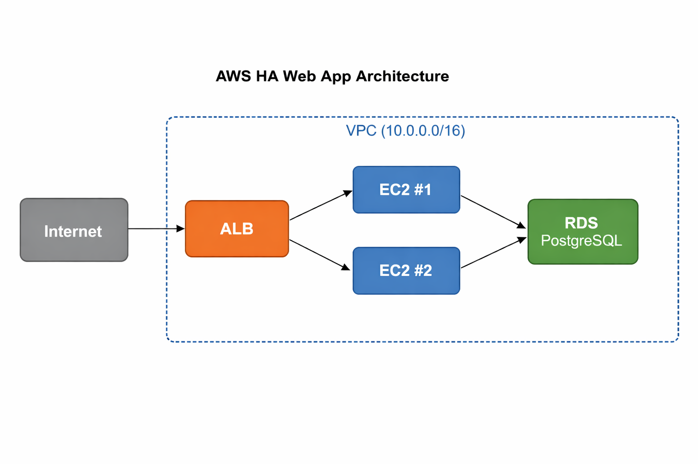

# AWS High-Availability Web Application

A production-grade, multi-AZ web application on AWS built entirely with Terraform.
Survives server failures automatically — zero manual intervention required.

## Architecture



**Services Used:**
- VPC with 3 public + 3 private subnets across 3 Availability Zones
- Application Load Balancer distributing traffic across servers
- Auto Scaling Group (EC2 t3.micro) — scales from 2 to 4 servers automatically
- RDS PostgreSQL Multi-AZ for the database
- CloudWatch monitoring + auto-scaling alarms
- NAT Gateway for secure outbound access from private subnets

## Live Demo

Refresh the page repeatedly — the `server` field changes each time,
proving the load balancer is routing to different servers across AZs.

## How to Deploy

### Prerequisites
- AWS account with CLI configured (`aws configure`)
- Terraform v1.7+

### Deploy (builds everything in ~15 mins)
```bash
git clone https://github.com/YOUR_USERNAME/aws-ha-webapp-terraform
cd aws-ha-webapp-terraform/terraform
terraform init
terraform apply
```

### Destroy (run this after demo to stop charges!)
```bash
terraform destroy
```

## CI/CD

GitHub Actions automatically runs `terraform plan` on every push
and every pull request to catch errors before they hit production.

## Cost

- Approx $3-8/day if left running (NAT Gateway + RDS)
- EC2 t3.micro is free-tier eligible
- Always run `terraform destroy` after your demo!

## Skills Demonstrated

- Infrastructure as Code (Terraform)
- AWS Networking (VPC, Subnets, IGW, NAT Gateway, Route Tables)
- High Availability (Multi-AZ, Auto Scaling Groups)
- Security (Security Groups with least-privilege, IAM roles)
- CI/CD (GitHub Actions)
- Monitoring (CloudWatch dashboards + alarms)
